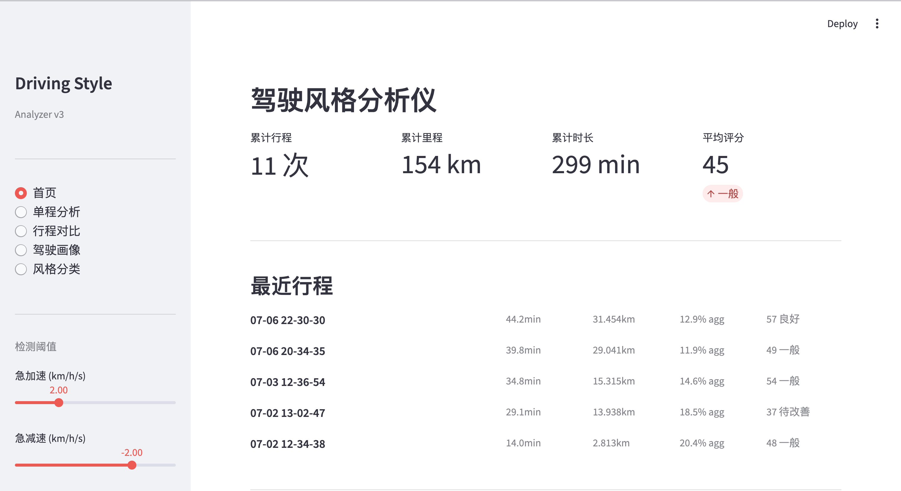

# 🚗 Driving Style Analyzer

*An open, interpretable toolkit that turns raw OBD-II data into actionable insights about how you drive.*

Most driving style analysis tools are black boxes—they give you a score but don't tell you why. This project is my attempt to build something transparent: every score is traceable to a specific driving behavior, every classification comes with an explanation.

> **Tech Stack:** Python · Streamlit · Pandas · Scikit-learn (K-Means, PCA) · Plotly · Matplotlib

[中文](./README_CN.md)



## 📡 Data Source

All trip data in `data/` is **real-world driving data collected from my own vehicle** via a Bluetooth OBD-II adapter and the [Car Scanner](https://www.carscanner.info/) app. Each CSV records second-by-second data including speed, RPM, throttle position, fuel rate, and GPS coordinates. This is not a synthetic dataset—every aggressive lane change, rush-hour crawl, and late-night highway cruise in here was me behind the wheel.

## ✨ Features

### 🌐 Web Interface (Streamlit)
- **Home** — Dashboard with cumulative stats, recent trips, feature correlation matrix
- **Single Trip** — Upload CSV to get speed curve (mode-colored), score cards, trip details, one-click CSV export
- **Compare** — Multi-select 2–4 trips; speed overlay, radar chart, metrics table, correlation heatmap
- **Profile** — Latest vs average radar chart, feature/score trends, full trip table, batch export
- **Classifier** — K-Means clustering + PCA visualization, auto-labeling, centroid analysis

### 🧠 Analysis Engine
| Module | Purpose |
|---|---|
| `features.py` | 26-dimensional feature extraction (speed, acceleration, modes, engine) |
| `style_classifier.py` | Unsupervised K-Means clustering + PCA + `classify_new()` |
| `scorer.py` | Percentile-based scoring (safety / smoothness / efficiency) |

### 📊 Data Support
- Car Scanner OBD CSV exports (semicolon-delimited)
- Auto-detects speed, RPM, throttle position and other PIDs
- Compatible with both GPS and OBD speed sources

## 🚀 Quick Start

```bash
git clone https://github.com/yourusername/Driving_style_analyzer.git
cd Driving_style_analyzer

python -m venv venv
source venv/bin/activate          # Windows: venv\Scripts\activate
pip install -r requirements.txt

streamlit run streamlit_app.py
```

Open `http://localhost:8501`, drag-and-drop a Car Scanner CSV.

## 📁 Project Structure

```
Driving_style_analyzer/
├── streamlit_app.py          # Web UI entry (5 pages)
├── requirements.txt
├── src/
│   ├── data_loader.py        # CSV parser (Car Scanner + UDDS)
│   ├── mode_detector.py      # Driving mode classification
│   ├── trip_analyzer.py      # Trip segmentation + statistics
│   ├── features.py           # 26-dim feature extraction
│   ├── scorer.py             # Percentile-based scoring engine
│   ├── style_classifier.py   # K-Means clustering + PCA + auto-label
│   ├── session_store.py      # Trip catalog management
│   ├── visualizer.py         # matplotlib static charts (CLI)
│   └── main.py               # CLI analysis entry point
├── data/                     # Real-world trip CSV data
├── images/                   # Screenshots
└── output/                   # CLI-generated charts (gitignored)
```

## 🔧 Detection Thresholds

Adjustable in the sidebar:
- **Hard acceleration** — default > +2.0 km/h/s
- **Hard braking** — default < -2.0 km/h/s
- **Stop threshold** — default < 1.5 km/h

## 📈 Scoring

Each trip is percentile-ranked against personal driving history:

| Dimension | Weight | Based on |
|---|---|---|
| 🛡️ Safety | 35% | Hard brake %, hard accel %, accel volatility |
| 🏓 Smoothness | 35% | Accel magnitude, speed variation |
| ⛽ Efficiency | 30% | Stop %, cruise %, RPM/throttle stability |

> 50 = historical median. Labels: ≥85 Excellent, ≥70 Great, ≥55 Good, ≥40 Fair, <40 Needs Work.

## 🧠 Style Classification

K-Means clustering identifies driving styles:
- **Aggressive** — Frequent hard accel, spirited city driving
- **Highway Cruise** — High highway %, relatively smooth
- **City Congestion** — High stop %, low average speed

New trips are auto-classified via `classify_new()`.

## 📦 Dependencies

- Python ≥ 3.9
- streamlit, plotly, pandas, numpy
- scikit-learn, matplotlib

## 📄 License

MIT
